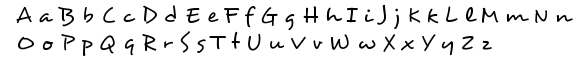

---

---

# Desyrel-Font

Desyrel is an unique handwriting-style, serif display font, available for use under the MIT License.

## Getting Started
--

### Examples:

### Prerequisites

What things you need to install the software and how to install them

### Installing
----

## Contributing

Please read [CONTRIBUTING.md](CONTRIBUTING.md) for details on our code of conduct, and the process for submitting pull requests to us.
 
## Authors

## License

This project is licensed under the MIT License - see the [LICENSE.md](LICENSE.md) file for details

## Acknowledgments
